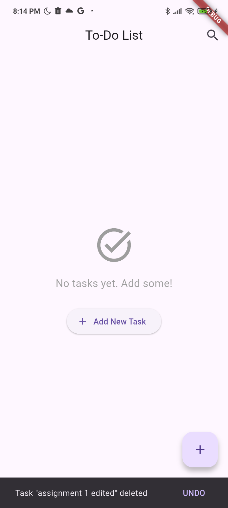

# Assignment 2
## Overview
This CRUD (Create, Read, Update, Delete) mobile application is created using Flutter with ObjectBox as the database. This application is inspired by any existing To-Do-List applications, especially Google Task as I mainly use that in my daily basis. This application is created to make it easier for users to organize their tasks or works.

## Explanation
1. `main.dart`
This file serves as the entry point for the Flutter application. It initializes the `ObjectBox` database and runs the main app widget, `MyApp`. The `MyApp` widget sets up the `MaterialApp` with a title and theme, and specifies the `TaskList` widget as the home screen. This structure establishes the foundation for the app, ensuring that the `ObjectBox` store is ready before the UI is built.
2. `task_list.dart`
The `TaskList` widget is responsible for displaying a list of tasks, allowing the users to view, search, add, edit, and delete tasks. It loads tasks from the `ObjectBox` database and maintains a filtered list based on a search query. The widget groups tasks by their deadlines and provides a floating action button to add new tasks. When a user interacts with a task, such as tapping to view details or editing, it navigates to the corresponding task detail or add/edit screen.
3. `add_task.dart`
This widget provides a user interface for adding or editing tasks. It accepts the function `onAdd` to handle addition of a new task and an optional `taskToEdit` parameter for editing an existing task. The widget maintains several text controllers for the task's title, description, and sub-tasks, as well as state variables for deadlines, due times, and sub-tasks list. During initialization, if a task is being edited, it populates the controllers with the task's existing data. The widget includes methods to add, remove, and toggle completion status of sub-tasks, and presents a form with text fields, date and time pickers, and a list of sub-tasks. The floating action button saves the task and invokes the provided `onAdd` callback.
4. `task_detail.dart`
The `TaskDetail` widget displays detailed information about a specific task. It takes a `Task` object, a callback for updating the task, and a callback for deleting it. The widget initializes with the provided task and updates its state when the task changes. The UI includes the task's title, description, completion status, deadline, due time, and sub-tasks. Users can edit the task or delete it through the app bar actions, which trigger appropriate dialogs for confirmation.
5. `task_item.dart`
The `TaskItem` widget represents a single task in a list, displaying its title, description, and status. It includes a checkbox for toggling completion and provides options to edit or delete the task through a popup menu. The widget also visually indicates if a task is overdue by comparing its deadline with the current date. This component is designed for use in a list view, allowing for interactive task management.
6. `task.dart`
This file defines the `Task` and `SubTask` classes, which represent the core data models for the application. The `Task` class includes properties for the task's title, description, completion status, deadline, and due time, along with methods for formatting the due date and time. It also contains a relationship with `SubTask` entities, allowing each task to have multiple sub-tasks. The `SubTask` class defines individual sub-tasks with a title and completion status, linked back to their parent task. This structure supports the application's functionality for managing tasks and their associated sub-tasks effectively.
7. `objectbox.dart`
In this file, the `ObjectBox` class encapsulates the logic for creating and managing an `ObjectBox` database store. It provides a private constructor and a static method `create` that asynchronously opens the store and returns an instance of `ObjectBox`. This abstraction allows for easy integration of `ObjectBox` into the application, facilitating data storage and retrieval.
8. `task_search_delegate.dart`
This class facilitates the search functionality within the task management app. It extends the `SearchDelegate` class and implements methods to build the search actions, leading, results, and suggestions. The search results display the tasks that match the user's query, and tapping on a suggestion navigates to the task detail screen. This delegate enhances the user experience by making it easy to find specific tasks quickly.
9. `objectbox-model.json`
This file defines the structure of data model used in the application. This file is essential for ObjectBox to understand how to store and retrieve the data.
10. `objectbox.g.dart`
This file is a generated Dart file that contains the code necessary to interact with `ObjectBox` database based on the model defined in the `objectbox-model.json`.

## How to use ObjectBox in Flutter
1. Add the lines below to `pubspec.yaml`.
```
dependencies:
    objectbox: ^4.1.0
    objectbox_flutter_libs: ^4.1.0
dev_dependencies:
    build_runner: ^2.4.15
    objectbox_generator: ^4.1.0
```
2. Generate `ObjectBox` code by running the command below to the Terminal.
```
flutter pub run build_runner build
```
3. Write your code.

## Screenshot
1. The blank page. This page will be displayed when a new user uses this application for the first time or if the user does not have any tasks. The user can click "Create" (`+`) button or `+ Add New Task` button to add or create a new task. Then, the user will be directed to `Add Task` page <br>

2. After the user click "Save" button in that page then _viola_ the task has been added to the list of the tasks. <br>

3. The user can click the task to see the detail of the task, and the `Task Details` page will be displayed. <br>

4. The user can tick the sub-task(s) when they already done with it, then the sub-task(s) will be marked as completed <br>

5. The user can mark the task(s) as completed. <br>

6. The user can edit the detail of their task by clicking the "Edit" button, then the information in `Task Details` page and `Home` page will also be updated <br>

7. The user can click the "vertical ellipsis" (`⋮`) button in the right side of the task to delete the task. Before the task is deleted, the user will be asked to confirm whether they want to delete it or not. <br>

8. If the task succesfully deleted and there is no more task left, the blank page will be displayed. <br>

