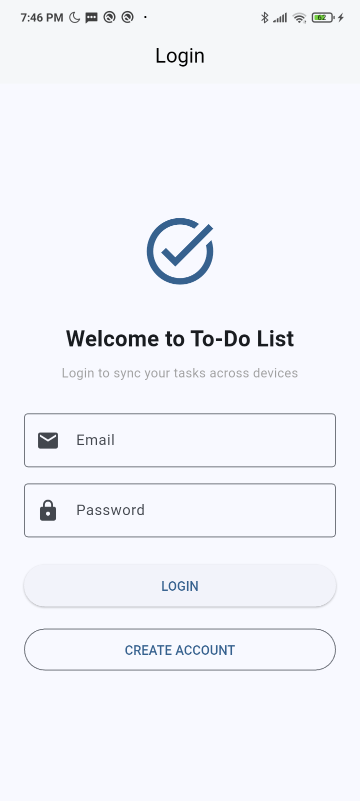

# Assignment 3
## Overview
This CRUD (Create, Read, Update, Delete) mobile application is created using Flutter with ObjectBox as the database. This application is inspired by any existing To-Do-List applications, especially Google Task as I mainly use that in my daily basis. This application is created to make it easier for users to organize their tasks or works.

## Major Modifications
1. Firebase Autentication - User login and registration
    - The app now requires authentication before accessing tasks
    - `AuthWrapper` class in `main.dart` manages the authentication
    - Users can create accounts, log in, and log out
    - Firebase Auth state is monitored to determine which screen to show
    ```
    // main.dart
    class AuthWrapper extends StatefulWidget {
        const AuthWrapper({super.key});
        @override
        _AuthWrapperState createState() => _AuthWrapperState();
    }
    class _AuthWrapperState extends State<AuthWrapper> {
        @override
        void initState() {
            super.initState();
            FirebaseAuth.instance.authStateChanges().listen((user) {
                if (mounted) {
                    setState(() {
                        _isInitialized = true;
                    });
                }
            });
        }
        @override
        Widget build(BuildContext context) {
            if (!_isInitialized) {
                return Scaffold(body: Center(child: CircularProgressIndicator()));
            }
            if (FirebaseAuth.instance.currentUser != null) {
                return const TaskList();
            } else {
                return LoginScreen(onLoginSuccess: _handleLoginSuccess);
            }
        }
    }
    ```
2. Push Notifications System - Using Awesome Notifications and Firebase Cloud Messaging
    - Integration of Awesome Notifications for local notifications
    - Firebase Cloud Messaging for push notifications
    - Different notification channels for:
        - Basic notifications
        - Deadline reminders
        - Task/subtask completion notifications
    - Scheduled notifications for task deadlines
    - Notification actions (mark complete, view task)
    ```
    // notification_service.dart
    Future<void> scheduleTaskReminderNotification(Task task) async {
        if (task.deadline == null) return;
        final dueDateTime = task.getFullDueDateTime();
        if (dueDateTime == null) return;
        final notificationMinutes = _preferences.getNotificationTime();
        final scheduledTime = dueDateTime.subtract(
            Duration(minutes: notificationMinutes),
        );
        if (scheduledTime.isAfter(DateTime.now())) {
            try {
                await AwesomeNotifications().createNotification(
                    content: NotificationContent(
                        id: task.id.hashCode,
                        channelKey: 'scheduled_channel',
                        title: 'Task Reminder: ${task.title}',
                        body: 'Your task "${task.title}" is due in $notificationMinutes minutes',
                    ),
                    schedule: NotificationCalendar(
                        year: scheduledTime.year,
                        month: scheduledTime.month,
                        day: scheduledTime.day,
                        hour: scheduledTime.hour,
                        minute: scheduledTime.minute,
                        // additional configuration
                    ),
                );
            } catch (e) {
                print('Error scheduling task reminder: $e');
            }
        }
    }
    ```
3. User Preferences System - Customizable notification settings
    - Users can customize notification timing (15, 30, 60, or 120 minutes before deadline)
    - Toggle notifications for task completion and subtask completion
    - Settings are persisted between app sessions
    ```
    // user_preferences.dart
    class UserPreferences {
        static final UserPreferences _instance = UserPreferences._internal();
        factory UserPreferences() => _instance;
        static const String _notificationTimeKey = 'notification_time';
        static const String _notifyTaskCompletionKey = 'notify_task_completion';
        static const String _notifySubtaskCompletionKey = 'notify_subtask_completion';
        static const int _defaultNotificationTime = 30;
        static const bool _defaultNotifyTaskCompletion = true;
        static const bool _defaultNotifySubtaskCompletion = true;
        int getNotificationTime() {
            return _prefs.getInt(_notificationTimeKey) ?? _defaultNotificationTime;
        }
        Future<bool> setNotificationTime(int minutes) async {
            return await _prefs.setInt(_notificationTimeKey, minutes);
        }
        // other preferences has similar methods
    }
    ```
4. Task Management Enhancement
    - Improved subtask state handling when marking tasks complete/incomplete
    - Notifications for task and subtask completion
    - Better deadline handling and overdue task indicators
    - Improved UI for task details and task list
    ```
    // task_detail.dart
    FloatingActionButton.extended(
        onPressed: () async {
            if (!_currentTask.isCompleted) {
                if (widget.onSubtaskStatesChanged != null) {
                    final currentStates = _currentTask.subTasks.map((st) => st.isCompleted).toList();
                    widget.onSubtaskStatesChanged!(_currentTask.id, currentStates);
                }
            final List<SubTask> updatedSubTasks = _currentTask.subTasks.map((subTask) {
                return SubTask(title: subTask.title, isCompleted: true);
            }).toList();
            final updatedTask = Task(
                isCompleted: true,
            );
            _handleTaskUpdate(updatedTask);
            await notificationService.sendTaskCompletionNotification(updatedTask);
            await notificationService.cancelTaskNotification(updatedTask);
            } else {
                // ...
            }
        },
    )
    ```
5. Code Structure and Architecture Improvements
    - Singleton pattern for services (NotificationService, UserPreferences)
    - Better separation of concerns between UI and business logic
    - More consistent error handling
    - Improved state management for task and subtask states

## New Files
1. `login_screen.dart`
This file is to handle user login
2. `signup_screen.dart`
This file is to handle user registration
3. `firebase_options.dart`
4. `notification_service.dart`
This file is to manage all notification functionality
5. `settings_screen.dart`
This file is the UI for configuring notification preferences

## How to use ObjectBox in Flutter
1. Log In to [Firebase](https://console.firebase.google.com/)
2. Create new Firebase project
3. Enable Firestore Database (Cloud Firestore)
4. Choose the Firestore location based on your region
5. Add Flutter as a platform
6. Install Firebase CLI and FlutterFire CLI
```
npm install -g firebase-tools
firebase login
flutter pub global activate flutterfire_cli
flutterfire configure
```
7. Install `firebase_core`, `cloud_firestore`, `firebase_auth`, and `awesome_notifications` packages in Flutter project.
```
flutter pub add firebase_core
flutter pub add cloud_firestore
flutter pub add firebase_auth
flutter pub add awesome_notifications
```
8. Run `flutter pub get` to make sure the packages are properly downloaded and linked
9. Go to [Firebase Console](https://console.firebase.google.com/) and select the project
10. Go to "Authentication" section
11. Click on "Get Started"
12. Click on "Sign-in method"
13. Enable Email/Password authentication
14. Click on "Save"
15. Write the rest of the code

# Notes
1. After adding the `awesome_notifications` dependency, modify the `android/app/build.gradle` file. Change the `compileSdkVersion` to 34, `minSdkVersion` to 23, and `targetSdkVersion` to 33.
2. To make sure that the app can have notifications, add those two lines to configure the permissions:
```
<uses-permission android:name="android.permission.SCHEDULE_EXACT_ALARM"/>
<uses-permission android:name="android.permission.ACCESS_NOTIFICATION_POLICY"/>
```
3. If there is an error related to NDK version when the application build in Android, change the NDK version into `ndkVersion = "27.0.12077973"`

# Screenshots
1. Login page is the first page that the user will see when they are opening the app and has not done any authentication. <br>

2. If the user has not created an account, the login will fail. The user has to create an account first. <br>

3. Click Create Account button and the user will be directed to Create Account page. <br>

4. If the Create Account or Login process successful, the user will be directed to Home page. <br>

5. In the Home page, the user can find Log Out button. If the user click the Log Out button, the user will be directed to Login Page again. <br>

6. Click Setting button to set notification preferences. The user can set the Deadline Reminders (15/30/60/120 minutes before the deadline) and the Task & Subtask Completion notification. <br>

7. The user can also do notification testing for the Deadline Reminders and Task Completion. Notification testing is to see the design of the notification and to see if the push notification already working or not. <br>

8. If the user mark the task completed, then the notification will be sent. The notification of task completion will send only if the user activate the notification for task completion. <br>
 <br>

9. If the user mark the subtask completed, then the notification will be sent. The notification of subtask completion will send only if the user activate the notification for subtask completion. <br>
 <br>

10. If the deadline is approaching (15/30/60/120 minutes before the deadline, depends on user preference), then the user will receive a reminder in forms of notification.
 <br>
