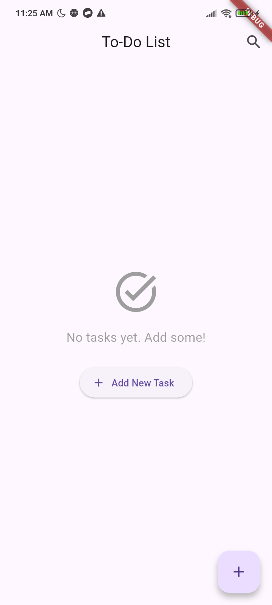

  <h1>Mobile Programming - EF234601 (2025)</h1>

  <b>Institut Teknologi Sepuluh Nopember</b> 
  Sepuluh Nopember Institute of Technology

  

This project is computer program developed as part of Assignment 1 for the Mobile Programming class. This program is made by <a href="https://github.com/aleahfaa">Iffa Amalia Sabrina</a>.

On behalf of:

**Agus Budi Raharjo, S.Kom., M.Kom., Ph.D.**

---

# Overview
This CRUD (Create, Read, Update, Delete) mobile application is created using Flutter. This application is inspired by any existing To-Do-List applications, especially Google Task as I mainly use that in my daily basis. This application is created to make it easier for users to organize their tasks or works.

# Explanation
1. `main.dart`
This is the entry point of this application. In `MyApp` class, it stated that the main application structure is build using stateless widget. In that class also defined the theme and sets the home screen to `TaskList`, which is where the tasks will be displayed.
2.`task_list.dart`
This file manages the list of the tasks. It uses `List<Task>` to hold the tasks and defines methods for adding, updating, deleting, and toggling tasks.
3. `add_task.dart`
This file handles adding and editing tasks. The state variables mantains controllers for text input, deadline, due time, and sub-tasks.
4. `task_detail.dart`
This file displays the details of a selected task. The state management initializes the current task and updates the UI when the task is modified.
5. `task_item.dart`
This file defines how each task is displayed in the list.
6. `task.dart`
This file defines the data models for tasks andd sub-tasks. `SubTask` class represents a sub-task with an ID, title, and completion status. `Task` class represents a task with various properties (ID, title, description, completion status, deadline, due time, and list of sub-tasks)

# Screenshot
1. The blank page. This page will be displayed when a new user uses this application for the first time or if the user does not have any tasks.  

2. Click "Create" (`+`) button in the home page to add or create a new task. Then, the user will be directed to this page.  

3. Fill the form with the details of the user's task.  

4. Click "Save" button in the right bottom and _viola_ the user's task has been added to the list of the tasks.  

5. Click the task to see the task detail and this page will be displayed.  

6. The user can mark the sub-tasks completed, if it is already completed and the title of the sub-tasks will be strikethrough.  

7. If the user click the "Edit" button, the user will be able to update the information of the task.  

8. The `Task Details` page will update the information and show the updated information once the user click "Save" button to save the updated information.  

9. If the user mark the Task completed, then the task will be strikethrough.  

10. The user can click the "vertical ellipsis" (`⋮`) button in the right side of the task to delete the task. Before the task is deleted, the user will be asked to confirm whether they want to delete it or not.  

11. If the task succesfully deleted and there is no more task left, the blank page will be displayed.  

# Video
[Video Link](https://drive.google.com/drive/folders/1rfV76XgCjYiCHYmew5ZsjqwmwH4QbaSC?usp=sharing)
[https://drive.google.com/drive/folders/1rfV76XgCjYiCHYmew5ZsjqwmwH4QbaSC?usp=sharing](https://drive.google.com/drive/folders/1rfV76XgCjYiCHYmew5ZsjqwmwH4QbaSC?usp=sharing)
